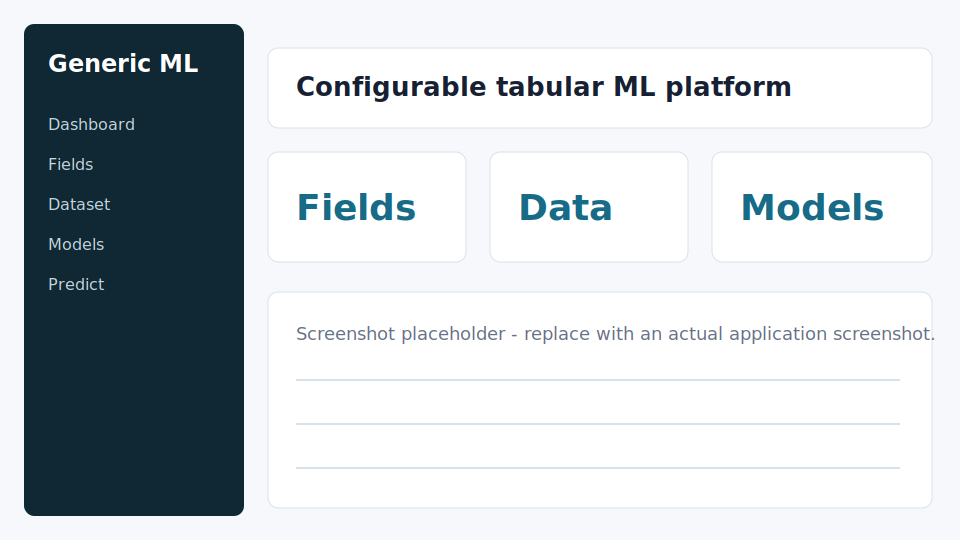

# 通用机器学习软件

通用机器学习软件是一个面向表格数据的本地 Web 应用。用户可以自定义输入字段、输出字段、字段类型，录入或导入数据，然后训练多个候选模型并进行预测。

当前版本支持：

- 输入/输出字段数量自定义
- 字段类型：数值、类别、布尔、日期/时间
- 数据录入、CSV/Excel 导入、CSV 导出
- 回归和分类任务
- 多候选模型训练、自动推荐、手动启用模型
- 本地 Web UI 和桌面 Web 壳



## Quick Start

### Windows

```powershell
.\start.ps1
```

或者双击/运行：

```bat
start.bat
```

### Linux/macOS

```bash
chmod +x start.sh
./start.sh
```

一键启动脚本会自动：

1. 创建 `.venv` 虚拟环境；
2. 安装 `requirements.txt`；
3. 执行数据库迁移；
4. 启动本地 Django 服务；
5. 打开浏览器访问应用。

默认地址是 `http://127.0.0.1:8000/`。如果端口被占用，脚本会在后续端口中选择可用端口。

## 使用流程

1. 打开“字段”页，创建输入字段和输出字段。
2. 打开“数据”页手动录入数据，或在“导入”页上传 CSV/Excel。
3. 打开“模型”页，点击“训练全部输出”。
4. 系统会为每个输出字段训练多个候选模型，并自动启用推荐模型。
5. 打开“预测”页，填写输入字段并查看预测结果。

## 示例数据

示例数据位于：

```text
examples/sample_regression_classification.csv
```

字段配置和导入步骤见：

```text
examples/README.md
```

## 手动启动

如果不使用一键脚本，可以手动运行：

```powershell
py -3 -m venv .venv
.\.venv\Scripts\python.exe -m pip install -r requirements.txt
.\.venv\Scripts\python.exe manage.py migrate
.\.venv\Scripts\python.exe manage.py runserver
```

Linux/macOS:

```bash
python3 -m venv .venv
.venv/bin/python -m pip install -r requirements.txt
.venv/bin/python manage.py migrate
.venv/bin/python manage.py runserver
```

## 桌面 Web 壳

```powershell
py -3 desktop_main.py
```

桌面壳会自动执行数据库迁移，启动本地服务，并打开同一套 Web UI。

## 环境变量

复制 `.env.example` 或直接设置环境变量：

```powershell
$env:DJANGO_SECRET_KEY="your-secret-key"
$env:DJANGO_DEBUG="1"
$env:GENERIC_ML_DATA_DIR="C:\Users\you\AppData\Local\GenericMLPlatform"
```

当前开发模式默认 `DJANGO_DEBUG=1`。生产部署时应设置安全的 `DJANGO_SECRET_KEY`，并关闭 debug。
`GENERIC_ML_DATA_DIR` 可选，用于指定 SQLite 数据库和模型文件的保存目录；源码运行默认保存在项目目录，打包版默认保存在用户本地数据目录。

## 本地 Windows 打包

需要先安装：

- Python 3.11+
- Inno Setup 6

然后运行：

```powershell
.\packaging\build_windows_installer.ps1
```

脚本会安装 PyInstaller，构建桌面 Web 壳，并尝试用 Inno Setup 生成安装包。输出目录为 `installer_output/`，该目录不会提交到 Git。

## 验证

```powershell
py -3 manage.py test
py -3 tools\verify_project.py
```

## 常见问题

### PowerShell 不允许运行脚本

使用：

```powershell
powershell.exe -ExecutionPolicy Bypass -File .\start.ps1
```

### 端口 8000 被占用

`start.ps1` 和 `start.sh` 会自动尝试后续端口。也可以指定端口：

```powershell
.\start.ps1 -Port 8100
```

Linux/macOS:

```bash
PORT=8100 ./start.sh
```

### 中文 CSV 乱码

建议使用 UTF-8 或 UTF-8-SIG 编码。项目源码、JSON、CSV 导入导出均按 UTF-8/UTF-8-SIG 处理。

## Contributing

请阅读 `CONTRIBUTING.md`。提交代码前至少运行：

```powershell
py -3 manage.py test
py -3 tools\verify_project.py
```

## License

MIT License. See `LICENSE`.
