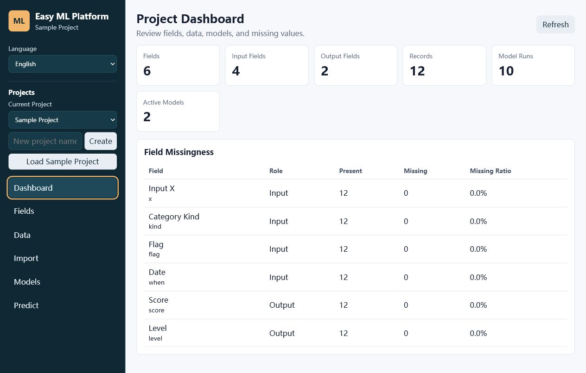

# Easy ML Platform

[中文](#中文) | [English](#english)




## 中文

Easy ML Platform 是一个初学者开发的早期项目，用于学习和尝试本地表格机器学习流程。它可以让用户自定义输入字段、输出字段和字段类型，录入或导入小型数据集，然后训练几个常见的传统机器学习模型并进行预测。

这个项目更适合学习、课程项目、原型验证和小规模本地数据实验。它不是成熟的 AutoML 平台，也不定位为生产级系统。

当前版本支持：

- 输入/输出字段数量自定义
- 字段类型：数值、类别、布尔、日期/时间
- 数据录入、CSV/Excel 导入、CSV 导出
- 回归和分类任务
- 多候选模型训练、自动推荐、手动启用模型
- 本地 Web UI 和桌面 Web 壳

当前版本暂不支持：

- 大规模数据集训练
- 深度学习、图像、文本或时序建模
- 后台训练队列、权限管理或团队协作
- 生产环境部署所需的完整安全与运维能力

### 下载安装包

Windows 用户可以直接下载 Release 安装包：

[下载 EasyMLPlatformSetup-0.2.2.exe](https://github.com/weizhiyuan0418/easy-ml-platform/releases/tag/v0.2.2)

安装包 SHA256：

```text
10616076698A3CE298359D60C108D4517827CD23F49D4EE62CAA0C4C55862187
```

### 一键启动源码版

Windows:

```powershell
.\start.ps1
```

也可以双击运行：

```bat
start.bat
```

Linux/macOS:

```bash
chmod +x start.sh
./start.sh
```

一键启动脚本会自动：

1. 创建 `.venv` 虚拟环境
2. 安装 `requirements.txt`
3. 执行数据库迁移
4. 启动本地 Django 服务
5. 打开浏览器访问应用

默认地址是 `http://127.0.0.1:8000/`。如果端口被占用，脚本会在后续端口中选择可用端口。

源码版需要 Python 3.12 或更新版本。

### 使用流程

1. 打开“字段”页，创建输入字段和输出字段。
2. 打开“数据”页手动录入数据，或在“导入”页上传 CSV/Excel。
3. 打开“模型”页，点击“训练全部输出”。
4. 系统会为每个输出字段训练多个候选模型，并自动启用推荐模型。
5. 打开“预测”页，填写输入字段并查看预测结果。

首次体验可直接点击侧边栏的“加载示例项目”，系统会自动创建示例字段和 12 条示例数据。

### 示例数据

示例数据位于：

```text
examples/sample_regression_classification.csv
```

字段配置和导入步骤见：

```text
examples/README.md
```

### 手动启动

如果不使用一键脚本，可以手动运行：

```powershell
py -3 -m venv .venv
.\.venv\Scripts\python.exe -m pip install -r requirements.txt
.\.venv\Scripts\python.exe manage.py migrate
.\.venv\Scripts\python.exe manage.py runserver
```

Linux/macOS:

```bash
python3 -m venv .venv
.venv/bin/python -m pip install -r requirements.txt
.venv/bin/python manage.py migrate
.venv/bin/python manage.py runserver
```

### 桌面 Web 壳

```powershell
py -3 desktop_main.py
```

桌面壳会自动执行数据库迁移，启动本地服务，并打开同一套 Web UI。

### 环境变量

复制 `.env.example` 或直接设置环境变量：

```powershell
$env:DJANGO_SECRET_KEY="your-secret-key"
$env:DJANGO_DEBUG="1"
$env:EASY_ML_DATA_DIR="C:\Users\you\AppData\Local\EasyMLPlatform"
```

当前开发模式默认 `DJANGO_DEBUG=1`，主要面向本地学习和开发使用。`EASY_ML_DATA_DIR` 可选，用于指定 SQLite 数据库和模型文件的保存目录；源码运行默认保存在项目目录，打包版默认保存在用户本地数据目录。旧变量 `GENERIC_ML_DATA_DIR` 仍保留兼容。

### 本地 Windows 打包

需要先安装：

- Python 3.12+
- Inno Setup 6

然后运行：

```powershell
.\packaging\build_windows_installer.ps1
```

脚本会安装 PyInstaller，构建桌面 Web 壳，并尝试用 Inno Setup 生成安装包。输出目录为 `installer_output/`，该目录不会提交到 Git。

### 验证

```powershell
py -3 manage.py test
py -3 tools\verify_project.py
```

### 常见问题

#### PowerShell 不允许运行脚本

使用：

```powershell
powershell.exe -ExecutionPolicy Bypass -File .\start.ps1
```

#### 端口 8000 被占用

`start.ps1` 和 `start.sh` 会自动尝试后续端口。也可以指定端口：

```powershell
.\start.ps1 -Port 8100
```

Linux/macOS:

```bash
PORT=8100 ./start.sh
```

#### 中文 CSV 乱码

建议使用 UTF-8 或 UTF-8-SIG 编码。项目源码、JSON、CSV 导入导出均按 UTF-8/UTF-8-SIG 处理。

#### 安装包为什么会有安全提示

这是个人学习项目，Windows 安装包目前没有代码签名证书。请只从本仓库 Release 页面下载，并用 README 中的 SHA256 校验值核对文件。

#### 数据保存在哪里

源码运行默认把 SQLite 数据库和模型文件保存在项目目录。安装包运行默认保存在当前 Windows 用户的本地应用数据目录。可以通过 `EASY_ML_DATA_DIR` 指定保存位置。

#### 适合多大的数据集

当前版本适合小型本地表格数据实验。训练在本地同步执行，数据量较大时会变慢或占用较多内存。

### 路线图与版本记录

- `ROADMAP.md`：短期计划和不计划支持的范围。
- `CHANGELOG.md`：版本变化记录。
- `docs/codex-plugins.md`：维护项目时推荐使用的 Codex 插件清单。
- `docs/release-checklist.md`：发布新版本前的检查清单。

### 贡献

请阅读 `CONTRIBUTING.md`。提交代码前至少运行：

```powershell
py -3 manage.py test
py -3 tools\verify_project.py
```

### 许可证

本项目使用 MIT License，详见 `LICENSE`。

## English

Easy ML Platform is an early-stage project built by a beginner for learning and trying local tabular machine learning workflows. It lets users define input fields, output fields, and field types, enter or import small datasets, train a few common traditional machine learning models, and run predictions.

This project is best suited for learning, coursework, prototypes, and small local data experiments. It is not a mature AutoML platform and is not intended to be a production-ready system.

Current features:

- Custom number of input and output fields
- Field types: numeric, categorical, boolean, date/time
- Manual data entry, CSV/Excel import, CSV export
- Regression and classification tasks
- Multiple candidate models, automatic recommendation, manual model activation
- Local Web UI and a desktop Web shell

Current limitations:

- No large-scale dataset training support
- No deep learning, image, text, or time-series modeling
- No background training queue, permission system, or team collaboration
- No complete security or operations setup for production deployment

### Download Installer

Windows users can download the Release installer directly:

[Download EasyMLPlatformSetup-0.2.2.exe](https://github.com/weizhiyuan0418/easy-ml-platform/releases/tag/v0.2.2)

Installer SHA256:

```text
10616076698A3CE298359D60C108D4517827CD23F49D4EE62CAA0C4C55862187
```

### One-Click Source Startup

Windows:

```powershell
.\start.ps1
```

Or double-click:

```bat
start.bat
```

Linux/macOS:

```bash
chmod +x start.sh
./start.sh
```

The startup scripts automatically:

1. Create a `.venv` virtual environment
2. Install `requirements.txt`
3. Apply database migrations
4. Start the local Django server
5. Open the application in a browser

The default URL is `http://127.0.0.1:8000/`. If the port is occupied, the scripts try later ports automatically.

The source startup path requires Python 3.12 or newer.

### Workflow

1. Open the Fields page and create input and output fields.
2. Open the Data page to enter records manually, or upload CSV/Excel files on the Import page.
3. Open the Models page and click Train All Outputs.
4. The system trains multiple candidate models for each output field and activates the recommended model automatically.
5. Open the Predict page, fill in the input fields, and view prediction results.

For a first trial, click Load Sample Project in the sidebar. The app creates sample fields and 12 sample records automatically.

### Example Dataset

The sample dataset is located at:

```text
examples/sample_regression_classification.csv
```

Field configuration and import steps are documented in:

```text
examples/README.md
```

### Manual Startup

If you do not use the one-click scripts, run:

```powershell
py -3 -m venv .venv
.\.venv\Scripts\python.exe -m pip install -r requirements.txt
.\.venv\Scripts\python.exe manage.py migrate
.\.venv\Scripts\python.exe manage.py runserver
```

Linux/macOS:

```bash
python3 -m venv .venv
.venv/bin/python -m pip install -r requirements.txt
.venv/bin/python manage.py migrate
.venv/bin/python manage.py runserver
```

### Desktop Web Shell

```powershell
py -3 desktop_main.py
```

The desktop shell applies database migrations, starts a local server, and opens the same Web UI.

### Environment Variables

Copy `.env.example` or set environment variables directly:

```powershell
$env:DJANGO_SECRET_KEY="your-secret-key"
$env:DJANGO_DEBUG="1"
$env:EASY_ML_DATA_DIR="C:\Users\you\AppData\Local\EasyMLPlatform"
```

Development mode defaults to `DJANGO_DEBUG=1` and is mainly intended for local learning and development. `EASY_ML_DATA_DIR` is optional and controls where the SQLite database and model files are stored. Source runs default to the project directory; packaged builds default to the user's local application data directory. The legacy `GENERIC_ML_DATA_DIR` variable is still supported for compatibility.

### Local Windows Packaging

Prerequisites:

- Python 3.12+
- Inno Setup 6

Then run:

```powershell
.\packaging\build_windows_installer.ps1
```

The script installs PyInstaller, builds the desktop Web shell, and tries to generate a Windows installer with Inno Setup. Output is written to `installer_output/`, which is ignored by Git.

### Verification

```powershell
py -3 manage.py test
py -3 tools\verify_project.py
```

### FAQ

#### PowerShell blocks script execution

Use:

```powershell
powershell.exe -ExecutionPolicy Bypass -File .\start.ps1
```

#### Port 8000 is already in use

`start.ps1` and `start.sh` automatically try later ports. You can also specify a port:

```powershell
.\start.ps1 -Port 8100
```

Linux/macOS:

```bash
PORT=8100 ./start.sh
```

#### Chinese CSV text is garbled

Use UTF-8 or UTF-8-SIG encoding. Source code, JSON files, and CSV import/export are handled as UTF-8/UTF-8-SIG.

#### Why does Windows show a security warning for the installer?

This is a personal learning project, and the Windows installer is not code-signed yet. Download it only from this repository's Release page and verify the file with the SHA256 value in this README.

#### Where is data stored?

Source runs store the SQLite database and model files in the project directory by default. Packaged builds store them in the current Windows user's local application data directory by default. You can set `EASY_ML_DATA_DIR` to choose a different location.

#### What dataset size is suitable?

The current version is intended for small local tabular data experiments. Training runs synchronously on the local machine, so larger datasets can become slow or memory-heavy.

### Roadmap and Changelog

- `ROADMAP.md`: short-term plans and intentionally unsupported scope.
- `CHANGELOG.md`: release history.
- `docs/codex-plugins.md`: recommended Codex plugins for maintaining this repository.
- `docs/release-checklist.md`: checklist for preparing a new release.

### Contributing

Read `CONTRIBUTING.md`. Before submitting changes, run at least:

```powershell
py -3 manage.py test
py -3 tools\verify_project.py
```

### License

This project is released under the MIT License. See `LICENSE`.
